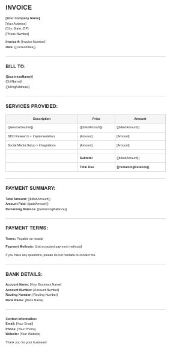
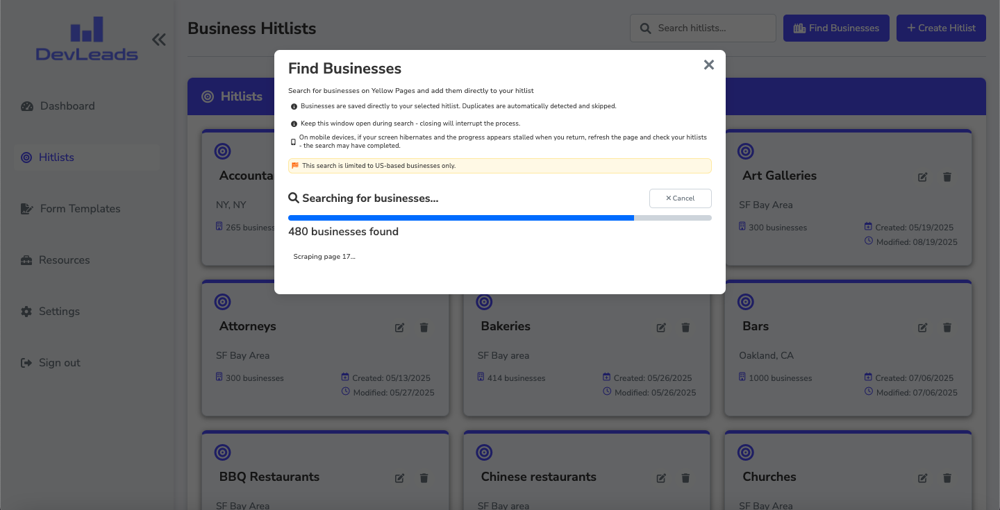
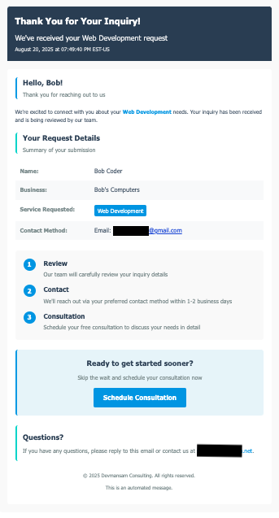

# DevLeads Features Documentation

Guide for features and functionality organized by application pages.

**→ [README](../README.md)** - Main project overview and introduction

**→ [Setup Guide](./SETUP-GUIDE.md)** - Complete installation and configuration guide

## Table of Contents

1. [Login Page](#login-page)
2. [Dashboard Page](#dashboard-page)
3. [Hitlists Page](#hitlists-page)
4. [Forms Page](#form-templates-page)
5. [Resources Page](#resources-page)
6. [Settings Page](#settings-page)
7. [Web Forms Integration](#web-forms-integration)
8. [Email Notifications](#email-notifications)
9. [Tips & Tricks](#tips--tricks)

---

## Login Page

Secure Firebase-powered authentication with modern login interface.


### Key Features

#### Login Interface
- **Professional Design**: Clean card-based layout with DevLeads branding
- **Dark/Light Mode**: Automatic theme detection based on system preferences
- **Responsive Design**: Optimized for desktop and mobile devices
- **Visual Feedback**: Loading states, error animations, and user-friendly messages

#### Authentication
- **Firebase Integration**: Secure email/password authentication
- **Session Persistence**: Maintains login state during browser session
- **Password Recovery**: Email-based password reset functionality
- **Auto-redirect**: Automatic dashboard redirect when authenticated

#### Security Features
- **Rate Limiting**: Protection against brute force attacks
- **Input Validation**: Client and server-side validation
- **Error Handling**: Specific, helpful error messages for common issues

### Usage Guide

1. **Login Process**:
   - Navigate to `/login` (or root URL redirects automatically)
   - Enter email and password credentials
   - Click "Sign In" to authenticate
   - Successful login redirects to dashboard

2. **Password Recovery**:
   - Enter email address in login form
   - Click "Forgot password?" link
   - Check email for reset instructions
   - Follow link to create new password

3. **Error Handling**:
   - System displays specific error messages for different issues
   - Visual shake animation indicates failed login attempts
   - Rate limiting prevents excessive failed attempts

---

## Dashboard Page

The main workspace where you manage leads, view analytics, and track your business performance.

### Analytics & Charts  

Interactive visualizations and key performance metrics with collapsible interface.


### Key Features

#### Dashboard Analytics
- **Lead Status Distribution**: Visual breakdown of lead statuses
- **Revenue Trends**: Monthly and yearly financial charts
- **Performance Metrics**: Key business indicators
- **Real-time Updates**: Live data visualization
- **Collapsible Sections**: Minimize/maximize chart sections for better screen space management

#### Chart Types
- **Pie Charts**: Status distribution and categorical data
- **Line Charts**: Revenue trends and time-based metrics
- **Bar Charts**: Comparative data and monthly summaries
- **Progress Indicators**: Goal tracking and completion rates

#### Key Metrics
- **Total Revenue**: All-time and monthly earnings
- **Active Leads**: Current pipeline status
- **Conversion Rates**: Lead-to-client conversion tracking
- **Average Project Value**: Financial performance indicators

### Available Charts

1. **Project Status Distribution**: Pie chart showing lead status breakdown
2. **New Leads vs. Closed (Won)**: Line chart comparing new leads to successfully completed projects
3. **Revenue Comparison by Month**: Bar chart showing monthly revenue trends

### Usage Guide

1. **Viewing Analytics**:
   - Dashboard displays key metrics automatically
   - Charts update in real-time as data changes
   - Interactive elements provide detailed information
   - Charts are responsive for mobile viewing
   - Click section headers to collapse/expand analytics sections

2. **Understanding Metrics**:
   - Status distribution shows pipeline health
   - Revenue trends indicate business growth
   - Conversion rates measure sales effectiveness
   - Project values help with pricing strategies

### Dashboard Views

Toggle between list and grid layouts for lead management.

### Key Features

- **List View**: Traditional table format with sortable columns
- **Grid View**: Card-based layout for visual lead overview
- **View Toggle**: Switch between layouts with single click
- **Responsive Design**: Both views adapt to screen size

### Usage Guide

- **Switch Views**: Click the list/grid toggle button in the dashboard toolbar
- **List View**: Best for detailed data comparison and sorting
- **Grid View**: Best for visual scanning and quick status overview


### Lead Management

The core feature for managing potential and existing clients throughout their lifecycle.

#### Key Features

#### Lead Creation

- **Manual Entry**: Add leads directly through the dashboard
- **Web Form Submissions**: Automatic lead creation from embedded forms
- **Convert from Hitlists**: Convert individual prospects from hitlists to leads

#### Lead Information
- **Personal Details**: Name, contact information, preferred contact method
- **Business Information**: Company name, business contact details
- **Project Details**: Service desired, budget, timeline, project description
- **Billing Address**: Complete address information for invoicing
- **Custom Fields**: Extensible data structure for additional information

#### Lead Status Management
- **Status Tracking**: New, Contacted, In Progress, Closed (Won), Closed (Lost)
- **Status Filtering**: Filter leads by current status
- **Status History**: Track status changes over time

#### Advanced Features
- **Search**: Text search across lead information
- **Status Filtering**: Filter leads by status (All, New, Contacted, In Progress, Closed Won, Closed Lost)
- **Sorting Options**: Sort by creation date, last contacted date, name, business name, or status (with ascending/descending options)
- **Pagination**: Configurable page sizes with "Show All" option
- **Export Capabilities**: 
  - **Bulk Export**: Export all leads as JSON or CSV from dashboard
  - **Individual Export**: Export single leads from lead detail view
  - **Complete Data**: Includes payments and all associated information

### Usage Guide

1. **Adding a Lead**:
   - Navigate to Dashboard
   - Click "Add New Lead"
   - Fill in required fields (name, email, service desired)
   - Add optional information (business details, address, etc.)
   - Save to create the lead

   * _**Leads from form submissions will automatically be populated in the dashboard**_


2. **Managing Leads**:
   - View all leads in the main dashboard table
   - Click on any lead to view/edit details
   - Use status tabs (desktop)/dropdown (mobile) to update lead progression
   - Use search bar to find specific leads
   - Apply filters to narrow down the list

3. **Export Leads**:
   - **Bulk Export**: Click "Export All" button on dashboard for all leads
   - **Individual Export**: Click "Export Lead" button in lead detail view
   - **Format Options**: Choose JSON or CSV format in export modal
   - **Complete Data**: Exports include payments and all associated information

4. **Lead Lifecycle**:
   - **New**: Just submitted or created
   - **Contacted**: Initial contact made
   - **In Progress**: Work has begun
   - **Closed (Won)**: Project completed successfully
   - **Closed (Lost)**: Lead did not convert

### Lead Information Window

When you click on any lead from the dashboard, a detailed information window opens showing all the lead's information organized in easy-to-navigate tabs.

#### Viewing vs Editing Modes

**View Mode (Default)**:
- **Read Information**: See all lead details in a clean, organized layout
- **Quick Actions**: Edit, Export, and Delete buttons at the top
- **Tab Navigation**: Click tabs to view different sections
- **One-Click Access**: Quick access to common actions

**Edit Mode**:
- **Update Information**: All fields become editable with helpful guidance
- **Save Changes**: Save button appears to keep your changes
- **Smart Validation**: System checks your entries and provides helpful tips
- **Auto-formatting**: Phone numbers, money amounts, and dates format automatically

#### Information Tabs


The lead information is organized into 7 sections for easy management:

### 1. Personal Information
**Contact details for the individual:**
- **Required Info**: First name, last name, email, phone number
- **Optional Info**: Phone extension, text messaging number
- **Smart Checking**: Email format validation, phone number formatting
- **Creation Date**: Shows when you first added this lead
- **Phone Formatting**: Automatically formats as (555) 123-4567


### 2. Business Information
**Company and work-related details:**
- **Company Info**: Business name, business phone with extension
- **Business Contact**: Business email address
- **Services**: What services the business provides
- **Smart Fields**: Some fields appear based on your selections
- **Flexible**: Business email is optional


### 3. Address Information
**Complete billing and mailing address:**
- **Full Address**: Street, apartment/unit, city, state, ZIP code, country
- **Map Integration**: "View on Google Maps" button when address is complete
- **Address Helper**: Ensures you have complete address information
- **Billing Ready**: Used for creating invoices and processing payments


### 4. Service & Status
**Project details and current status:**
- **Service Type**: What service they want (Web Development, App Development)
- **Website Info**: Do they have a website? If yes, what's the address?
- **Contact Preference**: How they prefer to be contacted
- **Current Status**: Where this lead stands in your process
- **Last Contact**: When you last spoke with them
- **Visual Status**: Color-coded status indicators for quick reference


### 5. Payments & Budget
**Money tracking and payment management:**
- **Budget Planning**: Their estimated budget and what you've billed
- **Payment Summary**: 
  - Total amount billed
  - Amount they've paid (calculated automatically)
  - Remaining balance (calculated automatically)
- **Payment History**: List of all payments with details
- **Payment Actions**: Add, edit, and delete payments (when editing)
- **Payment Details**: Each payment shows amount, date, and any notes
- **Auto-calculation**: Balance updates automatically when you add payments


### 6. Forms & Documents
**Generated documents and file management:**
- **Created Forms**: List of contracts, proposals, and invoices you've made
- **Document Actions**: View, edit, and delete forms (when editing)
- **Create New**: "Create Form" button to make new documents
- **Document Info**: When created, last changed, and document type
- **Template Magic**: Generate professional documents using their information
- **File Upload**: Upload signed contracts and other important documents
- **File Organization**: Keep all their documents in one place


### 7. Notes & Messages
**Communication tracking:**
- **Customer Message**: Their original inquiry or message
- **Your Notes**: Private notes for your team
- **Expanding Text**: Text areas grow as you type more
- **Detailed Records**: Keep comprehensive communication history


#### Smart Features

#### Easy Navigation
- **Desktop**: Tab bar with icons and clear labels
- **Mobile**: Dropdown menu showing current section
- **Keyboard Friendly**: Use keyboard to navigate between tabs

#### Input Validation
- **Real-time Help**: Immediate feedback as you type
- **Required Fields**: Clear indicators for what's required
- **Format Checking**: Validates formatting of email, phone numbers, websites, and money amounts
- **Helpful Messages**: Clear guidance on how to fix any issues

#### Auto-formatting Magic
- **Phone Numbers**: Automatically formats to (555) 123-4567
- **Money Amounts**: Properly formats dollar amounts
- **Dates**: Shows dates in your preferred format
- **Website URLs**: Automatically appends URLs when needed
- **Text Areas**: Dynamically expand to fit your content

#### Connected Features
- **Payment Integration**: Directly connected to your payment tracking
- **Document Creation**: Generate professional documents using lead/client information with built-in markdown editor
- **File Management**: Upload and organize PDF documents
- **Google Maps**: Click to view their address on Google Maps
- **Export Options**: Export individual lead information (bulk data can be exported from dashboard)

#### Detailed Usage Instructions

**Viewing Lead Information**:
- Click any lead card or table row from your dashboard
- Information window opens showing all their details
- Click the different tabs to see various information sections
- Use the action buttons at the top for Edit, Export, or Delete

**Updating Lead Information**:
- Open the lead information window and click "Edit"
- All tabs become editable with helpful form controls
- Make changes across any tabs you need
- Click "Save Changes" to keep all your updates
- Window automatically returns to view mode after saving

**Managing Payments**:
- Click the "Payments & Budget" tab
- See payment history and current balance
- When editing, use "Add Payment" to record new payments
- Add notes for individual payments
- Edit or delete existing payments using the action buttons
- Balance automatically updates based on your payments

**Working with Documents**:
- Go to "Forms & Documents" tab to see generated documents
- Click "Create Form" to make new contracts, proposals, or invoices
- View, edit, or delete existing documents
- Upload signed contracts and other important PDF files
- All documents are organized by lead

**Managing Contact Information**:
- Fill out complete address in "Address Information" tab
- Google Maps button appears when you have a complete address
- Set how they prefer to be contacted in "Service & Status" tab
- Set current lead status
- Track when you last contacted them for follow-up planning 

### Payment Tracking

Simple payment tracking system integrated directly into each lead's information.

#### Payment Features
- **Payment Records**: Track individual payments with amount, date, and notes
- **Automatic Calculations**: System automatically calculates total paid and remaining balance
- **Payment History**: View all payments for each lead in chronological order
- **Edit/Delete**: Modify or remove payments as needed (in edit mode)

#### Payment Information
Each payment record includes:
- **Amount**: Dollar amount of the payment
- **Payment Date**: When the payment was received
- **Notes**: Optional notes about the payment (purpose, method, etc.)

#### How It Works
- **Estimated Budget**: Set the client's estimated budget
- **Billed Amount**: Set the total amount you're billing for the project
- **Paid Amount**: Automatically calculated from all payment records (read-only)
- **Remaining Balance**: Automatically calculated (Billed Amount - Paid Amount) (read-only)
- **Payment List**: Shows all payments sorted by date

#### Adding Payments

**To Add a Payment**:
- Open any lead information window
- Go to "Payments" tab
- Click "Edit" mode
- Click "Add Payment" button
- Enter payment amount
- Select payment date 
- Add optional notes
- Click "Save Payment"

**Payment Management**:
- View all payments in the Payments tab
- In edit mode, use edit/delete buttons on each payment
- System automatically updates Paid Amount and Remaining Balance when payments change
- Balance calculations update in real-time

### Document Management

Generate professional documents with built-in markdown editor using lead data and upload/manage all files associated with leads and projects.

#### Form Generation Features
- **Template-Based Generation**: Create contracts, proposals, and invoices using pre-built templates
- **Lead Data Integration**: Automatically populate documents with lead information (name, address, project details, etc.)
- **Real-Time Preview**: See how documents will look with actual lead data
- **Multiple Formats**: Export as PDF or download as Markdown
- **Professional Output**: Print-ready, properly formatted documents

#### File Management Features
- **PDF Upload**: Upload signed documents and other files directly to leads
- **File Organization**: Organize documents by lead/project
- **File Metadata**: Track upload dates, file sizes, types
- **Secure Storage**: Protected document access

#### Document Types
- **Contracts**: Service agreements and legal documents
- **Proposals**: Project proposals and quotes
- **Invoices**: Billing documents and receipts
- **Specifications**: Project requirements and designs
- **Correspondence**: Email attachments and communications
- **Signed Documents**: E-signed contracts and agreements

#### E-Signature Workflow Tip
- **Generate Documents**: Create contracts/proposals using Form Builder
- **Get E-Signatures**: Consider using [OpenSign](https://www.opensignlabs.com/) (available in Resources as well) for free document signing
- **Upload Signed Docs**: Upload completed signed PDFs (e.g. contracts) back to the client's profile
- **Track Progress**: Monitor document status throughout the signing process

#### Access Control
- **Lead Association**: Documents linked to specific leads
- **Secure Access**: Authentication required for document access

### Document Management Guide

**Generating Documents from Templates**:
- Navigate to a specific lead information window
- Go to "Forms & Documents" tab
- Click "Create Form" button
- Select a template (contract, proposal, invoice, etc.)
- System automatically populates template with lead data
- Preview the generated document
- Edit and customize from built-in editor
- Export as PDF for client or download as Markdown

**Uploading Documents**:
- Navigate to a specific lead information window
- Go to "Forms & Documents" tab
- Click "Upload Document" or drag & drop files
- Select PDF file from computer
- Add document description
- Save document

**Managing Documents**:
- View all documents in lead profile
- Download documents for external use
- Delete outdated or unnecessary documents
- Organize documents by type or date

**Document Access**:
- Documents are accessible only to authenticated users
- Files are served securely through the application from MongoDB database
- Document URLs are protected

---

## Form Templates Page

Create and manage custom form templates for contracts, proposals, invoices, and other documents.


### Key Features

#### Template Management
- **Pre-built Templates**: Starter templates for common document types
- **Completely Customizable**: Customize any way you like
- **Custom Templates**: Create your own templates from scratch
- **Template Library**: Organize templates by category
- **Draft System**: Save work-in-progress forms as drafts before finalizing
- **Template vs Draft Filtering**: Separate views for production templates and draft content

#### Form Building
- **Markdown Support**: Rich formatting with Markdown syntax
- **Variable Substitution**: Dynamic content using lead data
- **Preview Mode**: See how forms will look with actual data
- **Template Cloning**: Duplicate existing templates as starting points


#### Document Generation
- **Lead Data Integration**: Automatically populate forms with lead information
- **PDF Export**: Generate PDF documents from templates
- **Markdown Export**: Download templates in Markdown format
- **Print-Ready Output**: Properly formatted for printing



### Available Templates

1. **Service Contract**: Professional service agreements
2. **Web Development Proposal**: Detailed project proposals
3. **Invoice Template**: Billing and payment documentation
4. **Project Requirements**: Detailed project specifications
5. **Statement of Work**: Scope and deliverables documentation

### Template Structure

Each template object requires these properties:

```javascript
{
  title: "Template Name",
  description: "Brief description",
  content: `Markdown content with {{variables}}`,
  category: "contract|proposal|invoice|agreement|other",
  isTemplate: true,
  variables: ["array", "of", "variables"]
}
```

### Available Variables

Based on the templates in the file, these variables are available:


#### Personal Information
- `firstName` - Client's first name
- `lastName` - Client's last name
- `fullName` - Client's full name
- `email` - Client's email address
- `phone` - Client's phone number

#### Business Information
- `businessName` - Business/company name
- `businessEmail` - Business email address
- `businessPhone` - Business phone number
- `billingAddress` - Complete billing address

#### Communication
- `preferredContact` - Preferred contact method

#### Project Information
- `serviceDesired` - Requested service description
- `estimatedBudget` - Client's estimated budget

#### Financial Information
- `billedAmount` - Amount billed to client
- `paidAmount` - Amount client has paid
- `remainingBalance` - Outstanding balance

#### Dates
- `currentDate` - Current date when form is generated
- `createdAt` - Date the client record was created

### Categories

Templates are organized into five categories:

- **contract** - Legal agreements and contracts
- **proposal** - Project proposals and quotes
- **invoice** - Billing and payment documents
- **agreement** - Service agreements and terms
- **other** - Reference materials, guides, and miscellaneous forms

### Draft vs Template System

DevLeads includes a powerful draft system to help you work on forms before making them available for production use.

#### Understanding Drafts vs Templates

**Templates**:
- **Production-ready** forms available for lead generation
- **Finalized content** tested and approved for client use
- **Searchable** in main template library
- **Used for document generation** with lead data

**Drafts**:
- **Work-in-progress** forms still being developed
- **Experimental content** or incomplete forms
- **Personal workspace** for form development
- **Not used for lead generation** until converted to templates

#### Draft Workflow

1. **Start with Draft**: Create new forms as drafts while developing content
2. **Iterate and Refine**: Edit and improve draft content without affecting production
3. **Test Content**: Preview drafts with sample data to ensure formatting works
4. **Convert to Template**: Change "Save as" setting from "Draft" to "Template" when ready

#### Filtering System

Use the dropdown filter to switch between views:
- **Templates**: Shows only production-ready templates (default view)
- **Drafts**: Shows only work-in-progress drafts

This separation keeps your workspace organized and prevents accidental use of incomplete forms.

### Usage Guide


1. **Creating a Template**:
   - Navigate to Forms page
   - Click "Create Form"
   - Enter form name and category
   - Choose "Template" from "Save as" dropdown
   - Write content using Markdown
   - Use variables like `{{firstName}}` for dynamic content
   - Save and test with sample data

2. **Working with Drafts**:
   - Navigate to Forms page
   - Click "Create Form"
   - Enter form name and category
   - Choose "Draft" from "Save as" dropdown
   - Develop content without pressure for perfection
   - Switch filter to "Drafts" to view all drafts
   - Convert to template when ready for production use

3. **Using Templates**:
   - Select a lead from the dashboard
   - Choose "Generate Form" from lead actions
   - Select the appropriate template (only templates appear, not drafts)
   - Review generated content
   - Export as PDF or download Markdown

4. **Template Variables**:
   Available variables include:
   - `{{firstName}}`, `{{lastName}}`, `{{businessName}}`
   - `{{email}}`, `{{phone}}`, `{{businessEmail}}`
   - `{{serviceDesired}}`, `{{message}}`
   - `{{billingAddress.street}}`, `{{billingAddress.city}}`
   - And more...

### Variable Usage

#### Basic Usage
<small>**_There is also a guide in "Other" category, as well as well as a link to to a reference guide on the "Resources" page_**</small>

Wrap variable names in double curly braces:

```markdown
Dear {{fullName}},

Thank you for choosing {{businessName}} for {{serviceDesired}}.
```

#### In Tables
```markdown
| Service | Amount |
|---------|--------|
| {{serviceDesired}} | {{billedAmount}} |
| Amount Paid | {{paidAmount}} |
| Balance Due | {{remainingBalance}} |
```

#### Important Rules
- Use double curly braces: `{{variableName}}`
- Variable names are case-sensitive
- List all variables in the `variables` array
- Check spelling carefully

### Running the Seeds

The project includes npm scripts to populate your database with the form templates:

**From server directory from command line:** 
#### `npm run seed:force`
 
  - Forces the form seeding process to run, deleting all existing templates and populating the forms page with fresh starter templates from the `formSeeds.js` file.

**Use this when:**
- You want to completely reset all templates
- You've made changes to existing templates and want to replace them

**Warning:** This will delete all existing form templates in your database.

#### `npm run seed:reset`
Inserts any starter template forms that are currently missing in the database (based on title), leaving existing forms untouched. Also resets the internal seeder status flag.

**Use this when:**
- You've added new templates to `formSeeds.js` and want to add them without affecting existing ones
- You want to restore any accidentally deleted default templates
- You need to reset the seeder status flag

**Safe option:** This preserves your existing custom templates.


---


## Hitlists Page

Organize and manage prospect businesses for outreach campaigns.


### Key Features

#### Hitlist Management
- **Multiple Lists**: Create separate lists for different campaigns
- **Business Profiles**: Detailed business information storage
- **Contact Tracking**: Multiple contacts per business
- **Campaign Organization**: Group prospects by type
- **Convert to Lead**: Escalate business from hitlist to main dashboard project with the click of a button


#### Business Data
- **Company Information**: Business name, type of business, complete address
- **Contact Details**: First name, last name, business phone with extension, business email
- **Website Information**: Website URL (automatically formatted)
- **Status Tracking**: Not Contacted, Contacted, Follow-up Required, Not Interested, Converted
- **Priority Levels**: High, Medium, Low priority settings
- **Last Contacted Date**: Track when you last reached out
- **Notes**: Detailed notes for each business


#### Integration Options
- **Business Finder**: Native automated business data collection from YellowPages.com
- **Import/Export**: 
  - **Import Data**: Import businesses from JSON or CSV files with duplicate checking
  - **Export Hitlist**: Export businesses as JSON or CSV formats
  - **Manual Import**: Add businesses individually with detailed information
- **Lead Generation**: Convert hitlist entries to active leads with full data transfer

### Usage Guide

1. **Creating Hitlists**:
   - Navigate to Hitlists page
   - Click "Create New Hitlist"
   - Enter hitlist name and description
   - Set campaign parameters
   - Begin adding businesses

2. **Adding Businesses**:
   - Open a hitlist and click "Add Business"
   - Enter business name and type of business
   - Add contact person's first and last name
   - Enter business phone (with optional extension) and email
   - Add website URL (optional)
   - Fill in complete business address
   - Set status (Not Contacted, Contacted, Follow-up Required, Not Interested, Converted)
   - Set priority level (High, Medium, Low)
   - Add last contacted date if applicable
   - Include any relevant notes
   - Save business profile

3. **Import/Export Data**:
   - **Import**: Click "Import Data" button, select JSON/CSV file with business data
   - **Export**: Click "Export Hitlist" button, choose JSON or CSV format
   - **Formats**: Supports standardized business data formats
   - **Validation**: Automatic duplicate checking during import

4. **Business Management**:
   - **Search Businesses**: Search within hitlists by business name or other details
   - **Filter by Status**: Filter businesses by their current status
   - **View Business Details**: Click any business to see complete information
   - **Edit Business Info**: Update business details, status, and notes
   - **Convert to Lead**: Convert interested prospects to leads with full data transfer
   - **Track Outreach**: Update status based on contact attempts and responses

### Business Finder

The Business Finder is built directly into DevLeads. It finds businesses from YellowPages.com, in real time, and adds them directly to your hitlists.


### Key Features
- **Native Integration**: No external tools needed
- **Direct to Hitlists**: Businesses are added automatically
- **US Businesses Only**: Searches YellowPages.com
- **Auto-deduplication**: Skips businesses already in your hitlist

### How to Use

#### Step 1: Access Business Finder
1. Go to **Hitlists** page in DevLeads
2. Click **"Find Businesses"** button (no need to select a hitlist first)
3. Business Finder modal opens - ready to search

#### Step 2: Configure Search
1. **Business Type**: Enter what you're looking for
   - Examples: "restaurants", "coffee shops", "dentists"
2. **Location**: Enter city/state or ZIP code
   - Examples: "New York, NY" or "10036"
3. **Max Results**: Use slider (5-1000 businesses, default 30)
4. **Select Hitlist**: Choose which hitlist to add businesses to, or create a new one

#### Step 3: Start Search
1. Click **"Start Search"**
2. Watch progress bar
3. Businesses appear in your hitlist as they're found
4. Wait for completion (usually 2-10 minutes)




### After the Search


#### What You Get
Each business includes:
- Company name
- Phone number  
- Address
- Website (when available)
- Rating

#### Next Steps
1. **Review Results**: Check the businesses added to your hitlist
2. **Clean Up**: Remove any irrelevant businesses
3. **Convert to Leads**: Click "Convert to Lead" for good prospects
4. **Start Outreach**: Use the contact information to reach out


### Tips for Better Results

- **Be Specific**: "web design" works better than "technology"
- **Use City, State**: "Denver, CO" works better than just "Colorado"
- **Start Small**: Try 50 businesses first to test results
- **Major Cities**: Get better results in populated areas

### Troubleshooting

#### Search Won't Start
- Fill in all required fields
- Check location format (City, State or ZIP)
- Refresh page and try again

#### No Results Found  
- Try broader business terms
- Check location spelling
- Try a bigger city
- Use ZIP code instead of city name

#### Search Takes Forever
- Reduce max results number
- Check internet connection
- Try during off-peak hours

### Requirements

- DevLeads deployed with Docker (includes Chrome support)
- At least one hitlist created
- Stable internet connection

That's it! The Business Finder is designed to be simple - find businesses and add them to your hitlists automatically.

---


## Web Forms Integration

Choose between two web components to collect inquiries on your website and automatically create leads in DevLeads.

### Choose Your Web Form

#### Quick Decision Guide

**Need a simple contact form?** → Use **Minimalist Contact Form**  
**Need detailed business inquiries?** → Use **Full Web Inquiry Form**

### Option 1: Minimalist Contact Form


**Best for:** Simple contact pages, basic lead capture, quick inquiries

#### Features
- **Lightweight**: Minimal code footprint
- **Essential Fields**: Name, email, phone, message
- **Auto-formatting**: Phone number formatting
- **Theme Detection**: Automatic dark/light mode
- **Real-time Validation**: Immediate feedback
- **Customizable**: Customizable styling for light and dark themes
- **Professional Design**: Clean, modern appearance
- **Toast Notifications**:  Built in toast notifications for successful and unsuccessful form submissions

#### Form Fields
- First Name (required)
- Last Name (required) 
- Email (required, validated)
- Phone (optional, auto-formatted)
- Message (required)

#### Setup Instructions
See [Setup Guide - Web Forms Integration](./SETUP-GUIDE.md#web-forms-integration-optional) for implementation details.

#### Repository
**Source**: https://github.com/DevManSam777/minimalist-contact-form

### Option 2: Full Web Inquiry Form


**Best for:** Business websites, detailed project inquiries, comprehensive lead data

#### Features
- **Multi-step Process**: Guided form completion with review step
- **Comprehensive Fields**: Business details, billing address, project requirements
- **Conditional Logic**: Show/hide fields based on selections
- **Advanced Validation**: Complex form validation
- **Theme Support**: Light/dark mode
- **Customizable**: Customizable styling 
- **Professional Layout**: Business-focused design
- **Toast Notifications**:  Built in toast notifications for successful and unsuccessful form submissions

#### Form Fields
- **Personal**: First name, last name, email, phone, extension
- **Business**: Company name, business phone, business email
- **Project**: Service type, budget, timeline, requirements
- **Billing**: Complete address information
- **Preferences**: Contact method, communication preferences

#### Setup Instructions
See [Setup Guide - Web Forms Integration](./SETUP-GUIDE.md#web-forms-integration-optional) for implementation details.

#### Repository  
**Source**: https://github.com/DevManSam777/web_inquiry_form

### Integration with DevLeads

#### API Endpoint Configuration

Both forms submit to your DevLeads API endpoint:
```
https://your-devleads-domain.com/api/leads
```

#### Automatic Lead Creation

When someone submits either form:
1. **Lead Created**: Automatically added to your DevLeads dashboard
2. **Email Notifications**: Admin and customer emails sent (if configured)
3. **Data Populated**: All form fields mapped to lead record
4. **Status Set**: Lead starts with "New" status for follow-up

#### Required DevLeads Setup

Before using web forms, ensure:
- [ ] DevLeads is deployed and accessible
- [ ] API endpoint is working (`/api/leads`)
- [ ] CORS is configured for your website domain
- [ ] Email notifications configured (optional but recommended)

### Comparison Chart

| Feature | Minimalist Form | Full Inquiry Form |
|---------|----------------|-------------------|
| **Setup Time** | 2 minutes | 5 minutes |
| **Fields** | 5 essential | 15+ comprehensive |
| **Use Case** | Contact/Support | Project Inquiries |
| **File Size** | Smaller | Larger |
| **Customization** | Basic | Extensive |
| **Business Data** | No | Yes |
| **Multi-step** | No | Yes |
| **Billing Address** | No | Yes |

### Implementation Guide

#### Step 1: Choose Your Form

**Decision Factors:**
- **Website Type**: Personal blog vs business website
- **Lead Quality**: Basic contact vs detailed project info
- **User Experience**: Simple vs comprehensive
- **Data Needs**: Essential vs detailed business information

#### Step 2: Deploy DevLeads

Ensure your DevLeads application is:
- Deployed and accessible online
- API endpoint responding at `/api/leads`
- CORS configured for your website domain

#### Step 3: Add Form to Website

**For Minimalist Form:**
```html
<!DOCTYPE html>
<html>
<head>
    <title>Contact Us</title>
</head>
<body>
    <h1>Get In Touch</h1>
    <contact-form endpoint="https://your-devleads-api.com/api/leads"></contact-form>
    
    <script src="https://raw.githack.com/DevManSam777/minimalist-contact-form/main/contact-form.js" defer></script>
</body>
</html>
```

**For Full Inquiry Form:**
```html
<!DOCTYPE html>
<html>
<head>
    <title>Project Inquiry</title>
</head>
<body>
    <h1>Start Your Project</h1>
    <web-inquiry-form api-url="https://your-devleads-api.com/api/leads"></web-inquiry-form>
    
    <script src="https://raw.githack.com/DevManSam777/web_inquiry_form/main/web-inquiry-form.js" defer></script>
</body>
</html>
```

#### Step 4: Test Integration

1. **Submit Test Form**: Fill out and submit the form
2. **Check DevLeads**: Verify lead appears in dashboard
3. **Test Emails**: Confirm notifications are sent
4. **Verify Data**: Ensure all fields are properly mapped

#### Step 5: Customize (Optional)

**Styling Options:**
- Primary colors to match your brand
- Font selection
- Light/dark theme preferences
- Custom messaging

### Advanced Configuration

#### CORS Setup

Update your DevLeads `server/server.js`:

```javascript
const allowedOrigins = [
  "https://www.yourdomain.com",
  "https://yourdomain.com",
  "http://localhost:3000", // for testing
];
```

#### Custom Event Handling

**Listen for form events:**
```javascript
// Track form submissions
document.addEventListener('form-submit', (event) => {
  console.log('Form submitted:', event.detail);
  // Add analytics tracking
});

// Handle successful submissions
document.addEventListener('form-success', (event) => {
  console.log('Success:', event.detail);
  // Redirect to thank you page
  window.location.href = '/thank-you';
});

// Handle errors
document.addEventListener('form-error', (event) => {
  console.error('Error:', event.detail);
  // Show custom error message
});
```

### Troubleshooting

#### Common Issues

**Form Not Submitting**
```bash
# Check browser console for errors
# Verify API endpoint URL
# Confirm CORS settings
```

**Leads Not Appearing**
- Verify DevLeads API is accessible
- Check API endpoint responds to POST requests
- Confirm database connection is working

**Email Notifications Not Sent**
- Verify email configuration in DevLeads
- Check spam folders
- Test email settings independently

**Styling Issues**
- Ensure CSS doesn't conflict with component styles
- Verify custom attributes and values are spelled and formatted correctly


#### Testing Checklist

- [ ] Form displays correctly on desktop
- [ ] Form displays correctly on mobile
- [ ] All required fields validate properly
- [ ] Form submits successfully
- [ ] Lead appears in DevLeads dashboard
- [ ] Email notifications are sent
- [ ] Custom styling applies correctly
- [ ] Error handling works properly

---

## Email Notifications

Automatic email notifications for lead management and customer communication.




### Key Features

#### Notification Types
- **Admin Notifications**: New lead alerts for business owner
- **Customer Confirmations**: Automatic confirmation emails to leads

#### Email Templates
- **Professional Design**: Responsive email templates
- **Brand Customization**: Customizable colors and branding 
- **Dynamic Content**: Personalized with lead information
- **Call-to-Action**: Embedded links and contact information


### Email Types

1. **New Lead Notification** (to admin):
   - Immediate notification of new lead submissions
   - Complete lead information included
   - Professional formatting with lead details

2. **Lead Confirmation** (to customer):
   - Thank you message for inquiry submission
   - Summary of their request
   - Next steps and timeline information
   - Contact information for questions
   - Call to action

### Usage Guide

1. **Email Configuration**:
   - Configure SMTP settings in environment variables
   - Test email functionality with sample sends
   - Customize email templates in emailNotification.js
   - Set up email addresses for notifications

2. **Template Customization**:
   - Modify email styling and branding
   - Update business information and contact details
   - Customize call-to-action buttons and links
   - Test templates with sample data

---

## Resources Page

Curated collection of developer tools, services, and resources organized by category.


### Resource Categories

#### Business Resources
Essential tools and services for running and managing your business operations, including scheduling software, proposal templates, project management platforms, e-signature solutions, payment processing, and productivity tools.

#### Design Resources
Creative tools and inspiration for visual design work, including graphic design platforms, color palette generators, interface design tools, icon libraries, typography resources, and UI/UX inspiration galleries.

#### Development Resources
Learning resources, documentation, and tools for software development, including learning, technical articles, template libraries, programming guides, reference documentation, and developer community platforms.

#### Tools & Utilities
Technical infrastructure and utility services for developers, including task automation, cloud platforms, version control, databases, API testing tools, and hosting solutions.

### Usage Guide

**Accessing Resources**:
- Navigate to Resources page from the sidebar
- Browse resources organized by category
- Click any resource link to visit the external website
- All resources open in new tabs/windows for convenience
- Resources are carefully curated for developers and small business owners

---

## Settings Page

Customize application behavior and user preferences.


### Key Features

#### Theme Settings
- **Interface Theme**: Light/dark theme toggle with system icons
- **Real-time Preview**: Theme changes apply immediately across the application
- **Persistent Storage**: Theme preference saved to user profile and localStorage

#### Date Format Settings  
- **Multiple Formats**: Choose from MM/DD/YYYY, DD/MM/YYYY, or YYYY-MM-DD
- **Live Example**: Real-time preview showing current date in selected format
- **Global Application**: Date format applies throughout the entire application
- **User Preference Storage**: Format preference saved in database

### Usage Guide

1. **Accessing Settings**:
   - Navigate to Settings from the sidebar
   - Settings page displays current preferences

2. **Theme Configuration**:
   - Click Light or Dark theme buttons in the Theme Settings section
   - Theme applies immediately system-wide
   - Choice is automatically saved

3. **Date Format Configuration**:
   - Click desired date format in the Date Format Settings section  
   - Example display updates to show current date in selected format
   - Format applies to dates throughout the application
   - Preference is automatically saved

---

## Tips & Tricks

### Best Practices

#### Lead Management
- ⚠️ Regularly update lead statuses to maintain accurate pipeline
- Use consistent naming conventions for lead sources
- Maintain detailed notes for each lead interaction

#### Form Templates
- Keep templates updated with current business information
- Test generated documents before sending to clients
- Use clear, professional language in all templates
- Maintain consistent branding across all documents
- Carefully go through generated forms and edit for your use case

#### Financial Tracking
- Record payments immediately upon receipt
- Reconcile payment records with bank statements
- Maintain detailed records for tax and accounting purposes

#### Data Security
- Regularly backup your database
- Use strong passwords for all accounts
- Keep environment variables secure and private
- Monitor access logs for unusual activity


### Hidden Features

- From within DevLeads, try clicking the current page heading at the top quickly 7 times for a surprise 
---

This feature guide covers general functionality in the DevLeads application. Each feature is designed to work together to provide a complete lead and project management solution for freelance developers and small businesses.
